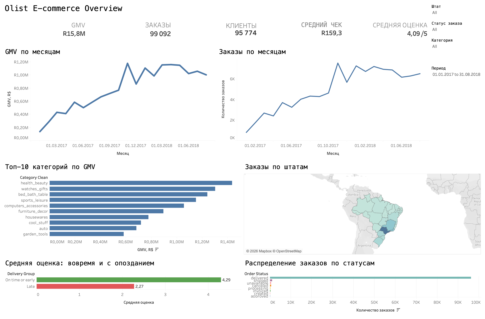
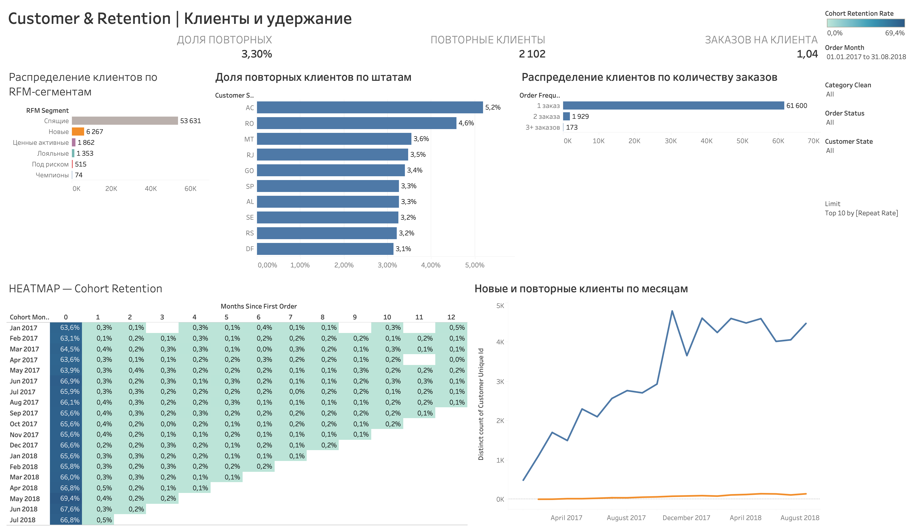
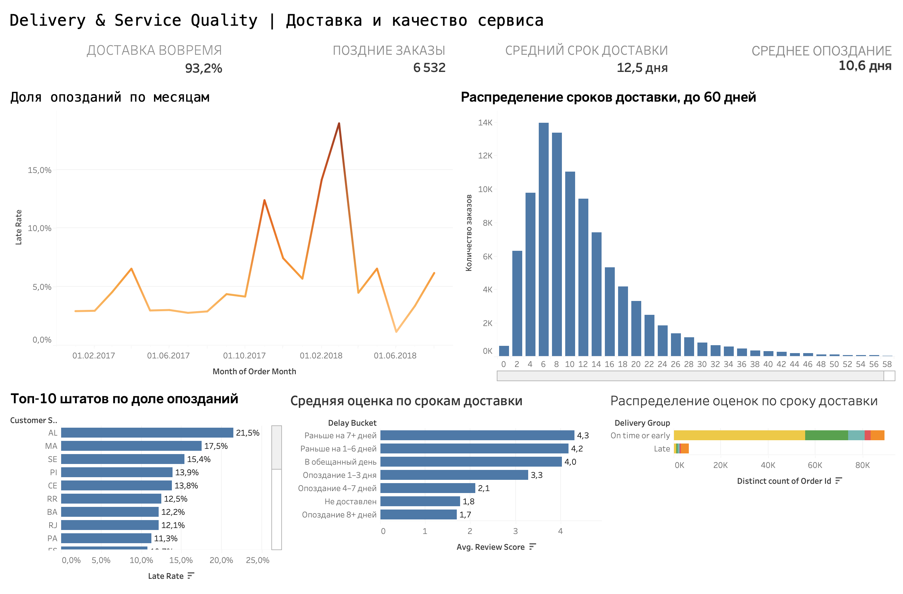

# Olist E-commerce Analytics — Tableau


Pet-проект по аналитике бразильского маркетплейса Olist. Три Tableau-дашборда объединяют Executive Overview, анализ клиентов и удержания, а также контроль доставки и качества сервиса.



## Зачем нужен дашборд

Дашборд предназначен для руководителя e-commerce и аналитика. Он помогает быстро ответить на четыре группы вопросов:

- как меняются GMV и количество заказов;
- какие категории и штаты формируют основной объём бизнеса;
- насколько стабильно выполняются заказы;
- как задержка доставки связана с клиентской оценкой.

Пользователь сначала видит пять ключевых KPI, затем динамику, товарно-географические драйверы и показатели качества исполнения заказов. Фильтры периода, штата, категории и статуса пересчитывают весь дашборд.

## Результат первой части

Период базового представления: **01.01.2017–31.08.2018**.

| KPI | Определение | Значение |
|---|---|---:|
| GMV | `SUM(price + freight_value)` | R$15,8 млн |
| Заказы | `COUNTD(order_id)` | 99 092 |
| Клиенты | `COUNTD(customer_unique_id)` | 95 774 |
| Средний чек | `GMV / COUNTD(order_id)` | R$159,3 |
| Средняя оценка | `AVG(review_score)` | 4,09 / 5 |

## Основные наблюдения

1. Продажи и заказы быстро росли в течение 2017 года, после чего вышли на более высокий, но волатильный уровень. Выраженный пик приходится на ноябрь 2017 года.
2. Наибольший GMV формируют категории `health_beauty`, `watches_gifts` и `bed_bath_table`.
3. Штат São Paulo заметно превосходит остальные регионы по количеству заказов, поэтому географическая концентрация должна учитываться при планировании логистики.
4. Заказы, доставленные вовремя или раньше, получают в среднем **4,29**, а опоздавшие — **2,27**. Разница составляет **2,02 балла** и указывает на сильную связь качества доставки с клиентским опытом.
5. Основная масса заказов имеет статус `delivered`; остальные статусы малы относительно общего объёма и требуют отдельного операционного мониторинга.

Наблюдения описательные: они показывают связь и структуру данных, но сами по себе не доказывают причинность.

## Часть 2 — Customer & Retention



Вторая часть отвечает на вопрос: **возвращаются ли клиенты после первой покупки и в каких сегментах есть потенциал для удержания?**

Дашборд объединяет три KPI и пять аналитических представлений:

- доля и количество повторных клиентов;
- среднее число заказов на клиента;
- распределение клиентской базы по RFM-сегментам;
- доля повторных клиентов в Top-10 штатах;
- частотность заказов: 1, 2 и 3+ заказа;
- когортное удержание по месяцам после первой покупки;
- динамика новых и повторных клиентов.

Главный вывод: клиентская база Olist в основном состоит из покупателей с одним заказом. Повторные покупки редки, а удержание после первого месяца остаётся низким. Поэтому приоритетом должны стать сценарии второй покупки: CRM-коммуникации, персональные рекомендации, повторные предложения в подходящий момент и отдельная работа с ценными активными и лояльными сегментами.

Подробное описание бизнес-логики, формул, RFM-сегментов и QA: [`docs/dashboard_v2.md`](docs/dashboard_v2.md).

## Часть 3 — Delivery & Service Quality



Третья часть отвечает на вопрос: **где нарушаются обещанные сроки доставки и как это связано с клиентским опытом?**

Ключевые результаты за 01.01.2017–31.08.2018:

- **93,2%** доставленных заказов пришли вовремя или раньше;
- **6 532** заказа опоздали, Late Rate — **6,8%**;
- средний фактический срок доставки — **12,5 дня**;
- среднее превышение обещанной даты среди поздних заказов — **10,6 дня**;
- средняя оценка снижается с **4,29** для своевременной доставки до **2,27** для поздней;
- доля оценок 1–2 балла возрастает примерно с **9,3%** до **62,4%**.

Дашборд показывает месячную динамику Late Rate, распределение фактических сроков, штаты риска, изменение средней оценки по величине задержки и структуру отзывов. Главный управленческий вывод: высокий общий SLA скрывает отдельные периоды и регионы с резким ростом риска, а задержка тесно связана с ухудшением клиентской оценки.

Подробное описание формул, визуализаций, QA и рекомендаций: [`docs/dashboard_v3.md`](docs/dashboard_v3.md).

## Что находится на дашборде

### KPI

- GMV;
- уникальные заказы;
- уникальные клиенты;
- AOV / средний чек;
- средняя оценка отзыва.

### Визуализации

- GMV по месяцам;
- заказы по месяцам;
- Top-10 категорий по GMV;
- карта заказов по штатам Бразилии;
- средняя оценка для своевременной и поздней доставки;
- распределение заказов по статусам.

### Глобальные фильтры

- период;
- штат клиента;
- категория товара;
- статус заказа.

Фильтр категории отделён от служебного Top-10: значение `All` не ограничивает общие KPI десятью категориями, а Top-10 применяется только к соответствующему графику.

## Модель данных

Вместо физического JOIN использованы Tableau Relationships — это снижает риск размножения строк заказа при работе с товарными позициями.

```text
orders ── order_id ── order_items ── product_id ── products
   │                                           │
   ├── customer_id ── customers               └── category ── translation
   │
   └── order_id ── reviews
```

Использованные таблицы:

- `olist_orders_dataset.csv`;
- `olist_order_items_dataset.csv`;
- `olist_customers_dataset.csv`;
- `olist_products_dataset.csv`;
- `product_category_name_translation.csv`;
- `olist_order_reviews_dataset.csv`.

## Расчётные поля

```tableau
// Order Month
DATETRUNC('month', [order_purchase_timestamp])

// Item GMV
[price] + [freight_value]

// AOV
SUM([Item GMV]) / COUNTD([order_id])

// Delay Days
DATEDIFF('day', [order_estimated_delivery_date], [order_delivered_customer_date])
```

`Delivery Group` разделяет доставленные заказы на `On time or early` и `Late`.

## Проверки качества

- период фильтра согласован между всеми листами;
- базовый итог — 99 092 уникальных заказа;
- глобальный фильтр категории не наследует Top-10;
- карта распознаёт 27 бразильских штатов;
- GMV считается на уровне товарной позиции, а количество заказов — через `COUNTD`;
- workbook повторно открыт в Tableau после финальной правки;
- финальный PNG третьего дашборда экспортирован средствами Tableau в разрешении 2732×1800.

## Как открыть проект

1. Скачайте [`tableau/olist_ecommerce_dashboard.twbx`](tableau/olist_ecommerce_dashboard.twbx).
2. Откройте файл в Tableau Desktop или Tableau Public.
3. Используйте фильтры справа для анализа периода, штата, категории и статуса.

CSV не хранятся отдельно в GitHub. Переносимая версия `.twbx` содержит необходимые данные. Исходный датасет: [Brazilian E-Commerce Public Dataset by Olist](https://www.kaggle.com/datasets/olistbr/brazilian-ecommerce).

## Ограничения

- GMV включает цену товара и стоимость доставки, но не является бухгалтерской выручкой или прибылью;
- в данных нет себестоимости, маркетинговых расходов и маржи;
- средняя оценка рассчитывается только по доступным отзывам;
- последний месяц в исходных данных неполный, поэтому период ограничен 31.08.2018;
- анализ не устанавливает причинно-следственную связь между задержкой и оценкой.

## Структура репозитория

```text
olist-tableau-analytics/
├── README.md
├── data/
│   └── README.md
├── docs/
│   ├── dashboard_v1.md
│   ├── dashboard_v2.md
│   └── dashboard_v3.md
├── images/
│   ├── olist_dashboard.png
│   ├── olist_customer_retention_dashboard.png
│   └── olist_delivery_service_dashboard.png
├── tableau/
│   ├── olist_ecommerce_dashboard.twb
│   └── olist_ecommerce_dashboard.twbx
└── .gitignore
```

## Roadmap

- **Часть 1 — Executive Overview:** готова.
- **Часть 2 — Customer & Retention:** готова — когорты, повторные покупки и RFM.
- **Часть 3 — Delivery & Service Quality:** готова — SLA, задержки, регионы риска и отзывы.

## Стек и личный вклад

`Tableau Desktop` · `Relationships` · `Calculated Fields` · `Dashboard Actions` · `Git/GitHub`

В рамках проекта самостоятельно собраны модель данных, расчётные поля, KPI, визуализации, глобальные фильтры, QA-проверки и документация репозитория.
