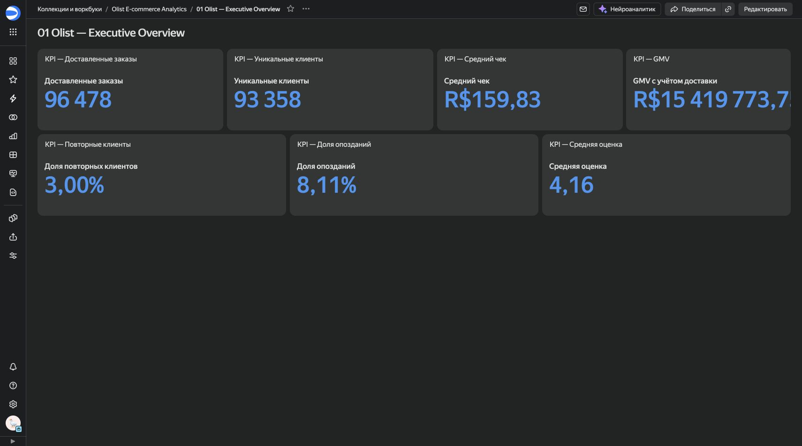
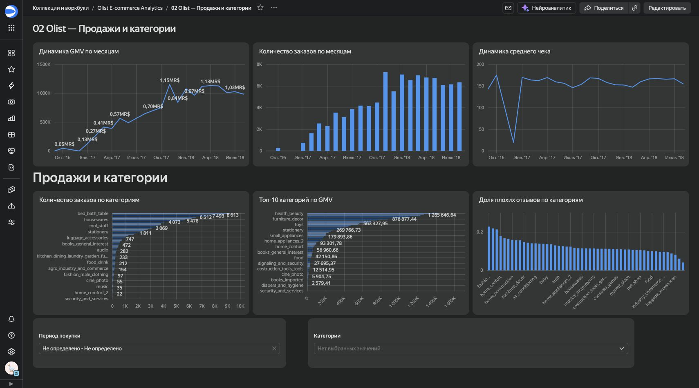
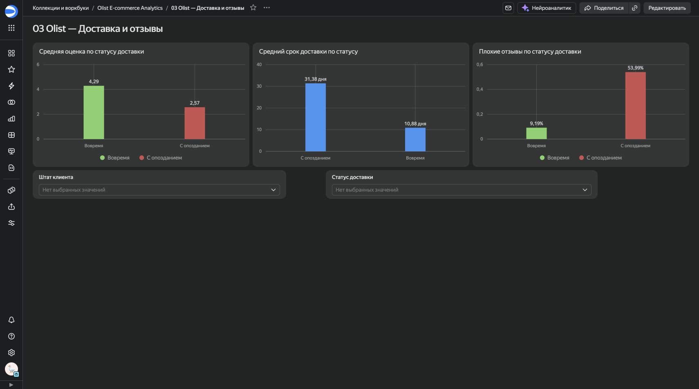
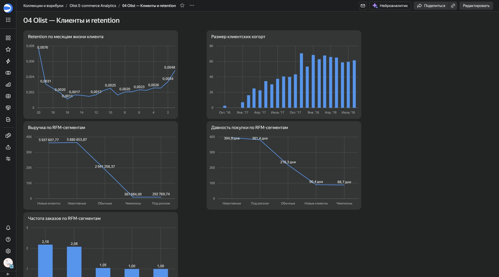

# Olist E-commerce Analytics - Yandex DataLens

Вторая BI-реализация проекта Olist. Tableau показывает работу с моделью данных,
relationships и интерактивными действиями, а DataLens демонстрирует отдельный
подход: компактные аналитические витрины, управленческие страницы и селекторы,
настроенные только для совместимых наборов данных.

## Открыть дашборды

| Страница | Назначение | Селекторы |
|---|---|---|
| [01 Executive Overview](https://datalens.ru/uoxcr8t1e4gid-01-olist-executive-overview) | KPI, динамика GMV, категории и влияние доставки на отзывы | без глобальных селекторов: KPI показывают базовый срез |
| [02 Продажи и категории](https://datalens.ru/2w6ndag4nwgel-02-olist-prodazhi-i-kategorii) | динамика продаж, средний чек и товарные категории | период покупки, категория |
| [03 Доставка и отзывы](https://datalens.ru/wq0mfadgz3fef-03-olist-dostavka-i-otzyvy) | SLA, сроки, отзывы и регионы риска | штат клиента, статус доставки |
| [04 Клиенты и retention](https://datalens.ru/f9j5idb25b1wy-04-olist-klienty-i-retention) | когортное удержание и RFM-сегментация | месяц когорты, RFM-сегмент |

Ссылки ведут на рабочие объекты DataLens. Если публичный доступ отключён,
DataLens попросит авторизоваться в аккаунте с доступом к воркбуку.

### Executive Overview



### Продажи и категории



### Доставка и отзывы



### Клиенты и retention



## Ключевые KPI DataLens

DataLens-версия использует доставленные заказы и полный доступный период
2016-2018 годов.

| Метрика | Значение |
|---|---:|
| Доставленные заказы | 96 478 |
| Уникальные клиенты | 93 358 |
| GMV с учётом доставки | R$15 419 773,75 |
| Средний чек | R$159,83 |
| Доля повторных клиентов | 3,00% |
| Средняя оценка | 4,16 |
| Доля опозданий | 8,11% |

Главный операционный вывод: среди заказов, доставленных вовремя, доля плохих
отзывов составляет 9,19%, а среди опоздавших - 53,99%. Средняя оценка при этом
снижается с 4,29 до 2,57.

## Архитектура

DataLens получает не исходные таблицы Olist, а шесть небольших витрин:

```text
Python preparation
       |
       +-- executive_kpis.csv
       +-- monthly_sales.csv
       +-- category_performance.csv
       +-- delivery_quality.csv
       +-- cohort_retention.csv
       +-- rfm_segments.csv
                    |
                    v
        DataLens datasets and charts
                    |
                    v
            4 dashboard pages
```

Такое разделение снижает риск размножения строк при JOIN и делает определения
метрик прозрачными. Каждый селектор применяется только к чартам из совместимой
витрины: например, выбор категории не изменяет когортный retention.

## Состав каталога

```text
datalens/
|-- README.md
|-- DATALENS_STEP_BY_STEP.md
|-- prepare_datalens_data.py
|-- requirements.txt
`-- data/
    |-- executive_kpis.csv
    |-- monthly_sales.csv
    |-- category_performance.csv
    |-- delivery_quality.csv
    |-- cohort_retention.csv
    `-- rfm_segments.csv
```

Подробная ручная сборка подключения, датасетов, расчётных полей, чартов и
селекторов описана в
[`DATALENS_STEP_BY_STEP.md`](DATALENS_STEP_BY_STEP.md).

Для пересборки витрин поместите исходные CSV Olist в `data/raw/`, затем
выполните:

```bash
python -m pip install -r datalens/requirements.txt
python datalens/prepare_datalens_data.py
```

## Tableau и DataLens: почему KPI различаются

В Tableau базовый экран ограничен периодом 01.01.2017-31.08.2018 и включает
заказы согласно логике workbook. DataLens считает метрики по доставленным
заказам за весь доступный период. Поэтому небольшое различие KPI между двумя
реализациями ожидаемо и не является ошибкой визуализации.

| Реализация | Основной аналитический срез |
|---|---|
| Tableau | 01.01.2017-31.08.2018, интерактивная модель исходных таблиц |
| DataLens | доставленные заказы, 2016-2018, подготовленные витрины |

При сравнении инструментов оценивается не равенство чисел между разными
срезами, а корректность расчётов внутри каждого явно определённого среза.
